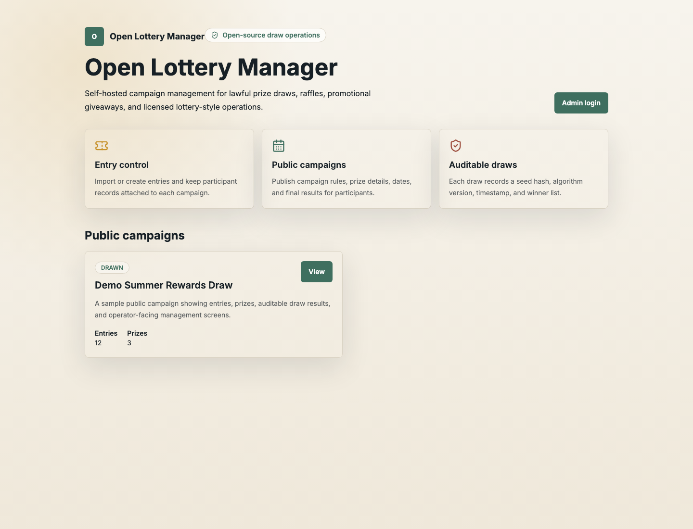
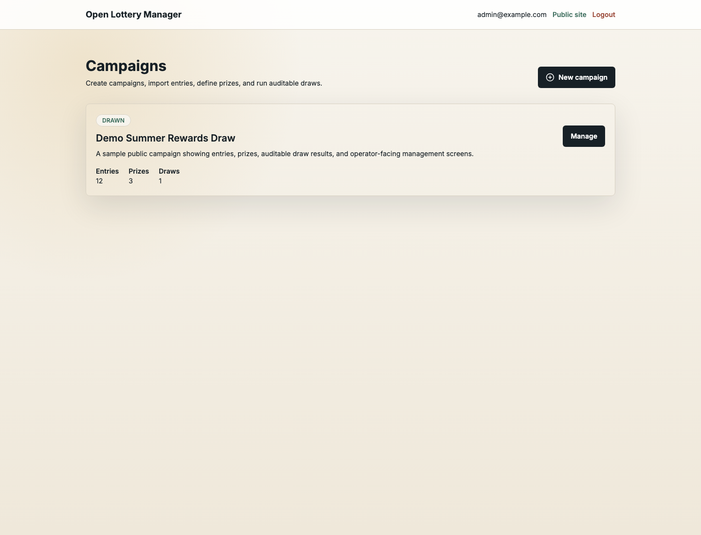
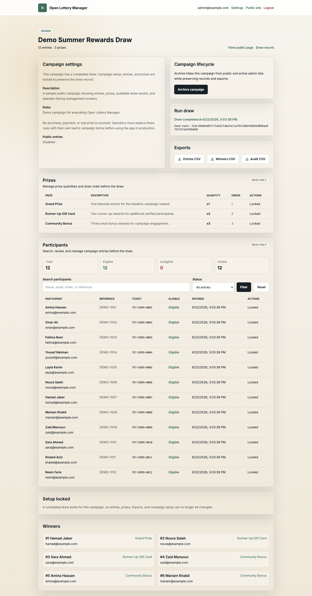
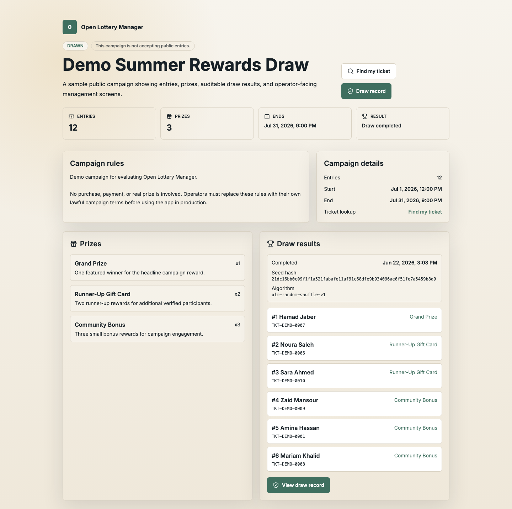

# Open Lottery Manager

[](https://github.com/qtrcipher/open-lottery-manager/actions/workflows/ci.yml)
[](LICENSE)

Open Lottery Manager is a self-hosted web app for lawful prize campaigns, raffles, promotional draws, and licensed lottery-style operations. It gives operators a simple admin dashboard, public campaign pages, auditable winner selection, and export-friendly results.

This project is software only. Operators are responsible for complying with all applicable licensing, age, tax, prize, advertising, consumer protection, and gambling laws in the places where they use it.

## What This Is

- A free, self-hosted campaign manager for operators who already know their promotion is lawful.
- A Next.js, Prisma, SQLite, and Docker app that can be run on your own infrastructure.
- A tool for managing entries, prizes, public campaign pages, draw records, and CSV exports.

## What This Is Not

- Not a hosted lottery service, payment processor, wallet, KYC provider, or compliance product.
- Not legal advice and not a substitute for licensing, regulatory review, or independent auditing.
- Not designed for real-money gambling without additional controls and jurisdiction-specific review.

## Features

- Campaign setup with public rules, dates, and status.
- Fixed prize lists with one or more winners.
- Public participant entry forms, manual entry creation, and CSV import.
- Auditable draws using server-side cryptographic randomness.
- Public results pages with seed hashes and algorithm version.
- Operator branding settings for name, tagline, support email, logo URL, and primary color.
- Single-admin authentication for small self-hosted deployments.
- SQLite persistence through Prisma.

## Quick Start

```bash
npm install
cp .env.example .env
npm run hash-password -- "change-me"
npm run db:push
npm run dev
```

Update `.env` with the generated `ADMIN_PASSWORD_HASH`, a strong `AUTH_SECRET`, and your admin email. Then visit `http://localhost:3000/admin/login`.

## Demo Data

Load a sample campaign with prizes, entries, completed draw results, and audit records:

```bash
npm run db:seed
```

The seed is idempotent and only replaces the fixed demo campaign at `/campaigns/demo-summer-rewards`.

## Screenshots









## Run With Docker

Docker Compose is the recommended self-hosting path for small deployments. It stores SQLite data in a named volume so campaign and draw records survive container restarts.

```bash
git clone https://github.com/qtrcipher/open-lottery-manager.git
cd open-lottery-manager
cp .env.example .env
npm install
npm run hash-password -- "change-me"
```

Update `.env` with:

- `AUTH_SECRET`: a long random value.
- `ADMIN_EMAIL`: the admin login email.
- `ADMIN_PASSWORD_HASH`: the generated password hash.

Then start the app with the production template:

```bash
docker compose -f docker-compose.prod.yml up --build
```

Open `http://localhost:3000/admin/login`. The production Compose template uses `DATABASE_URL=file:/app/data/prod.db` and persists that database in the `lottery-data` volume.

For production setup, backups, reverse proxy notes, and upgrades, see [DEPLOYMENT.md](DEPLOYMENT.md).

## Production Self-Hosting Checklist

- Generate a long random `AUTH_SECRET`; never reuse the example value.
- Generate `ADMIN_PASSWORD_HASH` with `npm run hash-password -- "your-password"`.
- Use Docker Compose or another persistent volume for SQLite, and back up the database before draws and before upgrades.
- Put the app behind HTTPS and a trusted reverse proxy. Control forwarded IP headers before relying on rate limits.
- Set a real `ADMIN_EMAIL`, configure support details in `/admin/settings`, and replace demo rules before publishing campaigns.
- Verify runtime health with `/api/health` after deployment.
- Confirm legal, tax, age, prize, advertising, and licensing requirements before accepting public entries.
- Keep dependencies updated and review `SECURITY.md` before reporting vulnerabilities.

## CSV Import Format

Use a header row with these columns:

```csv
name,email,reference
Fatima Noor,fatima@example.com,INV-1001
Omar Ali,omar@example.com,INV-1002
```

`reference` is optional, but each email and reference must be unique within a campaign.

## Public Entries

Admins can enable public entries per campaign. Public entry forms appear only when a campaign is published, open, inside its configured date window, and has no completed draw. After a participant enters, the app shows a ticket code for their records.

Participants can revisit `/campaigns/[slug]/lookup` to find their ticket code with the email address used for entry and an optional reference.

Public entry and lookup forms include basic abuse protection: a hidden honeypot field and per-campaign IP rate limits stored in the SQLite database. For high-traffic or regulated deployments, put the app behind a trusted reverse proxy, WAF, or CAPTCHA service, and make sure forwarded IP headers are controlled by your proxy.

## CSV Export

Campaign admins can download CSV records from the campaign management page:

- entries: all tickets and participant details.
- winners: completed draw winners, prize names, seed hash, and algorithm version.
- audit log: campaign, entry, prize, import, and draw activity tied to the campaign.

## Campaign Lifecycle

Archive old campaigns to remove them from public and active admin lists while preserving entries, winners, exports, and audit history. Archived campaigns can be restored from the admin dashboard or campaign management page.

Delete is only available for draft campaigns with no completed draw. The admin must type the campaign title exactly before deletion.

## Draw Record

Completed public campaigns include a draw record page at `/campaigns/[slug]/verify`. It shows the recorded seed hash, algorithm version, draw timestamp, entry counts, winner count, and ordered winners for participant inspection.

The draw record page is not an independent recomputation of the draw. It does not expose the raw draw seed and does not replace legal, regulatory, or independent audit requirements.

## Branding Settings

Admins can customize the operator identity at `/admin/settings`. Configure the public operator name, tagline, support email, hosted logo URL, and primary brand color. Existing deployments should run `npm run db:push` after pulling this version so the settings table exists.

## Legal And Compliance Notice

Do not use this app to operate a real-money lottery, gambling product, paid raffle, or regulated promotion unless you have confirmed that your use is lawful. This app does not provide KYC, geolocation, payment processing, tax reporting, responsible gaming controls, or regulatory certification.

## Repository Status

This repository is public and free to use under the MIT License. It is provided as self-hosted software for operators and developers; it is not a managed service and does not include regulatory certification.

## Scripts

- `npm run dev`: start the local development server.
- `npm run build`: generate Prisma Client and build the app.
- `npm run lint`: run Next.js lint checks.
- `npm test`: run automated tests.
- `npm run db:push`: apply the Prisma schema to the configured SQLite database.
- `npm run db:seed`: load the demo campaign.
- `npm run backup`: copy the production SQLite database from Docker storage into `backups/`.
- `npm run hash-password -- "password"`: generate an admin password hash.
- `npm run smoke:deploy -- http://localhost:3000`: verify a deployed app and database health check.
- `npm run screenshots`: capture README screenshots from a running local app.
